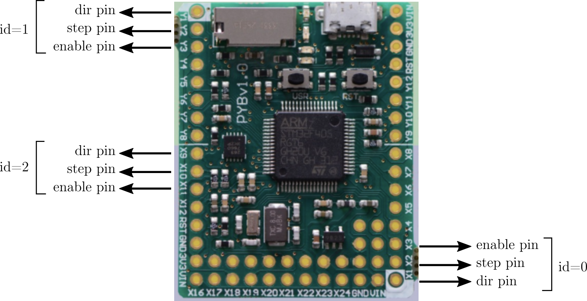

# Introduction

pwmStepper is a micropython stepper motor driver for the Pyboard V1.0 and V1.1. 
It drives bipolar stepper motors throught hardware drivers like A4988, DRV8825, ...
A pwm signal with 5us length and adjustable period is generated for the step pin. 
Up to three motors can run simultaneoulsy and independantly.
A step counter keeps track of the motor position automatically.
Each motor speed can be changed "in the fly".

# The wiring

# The driver

Copy pwmStepper.py in the Pyboard filesystem, then:

    >>> from pwmStepper import *
    >>> m0 = pwmStep(0)      # instantiate motor 0 with default config
    >>> m1 = pwmStep(1)      # instantiate motor 1 with default config
    >>> m1 = pwmStep(2)      # move motor 0 100 steps forward
    >>> m2.doSteps(-50)      # move motor 1 50 steps backward

## Configuration parameters

They must be set at object creation time:

    >>> m0 = pwmStep(..., param=param_value, ...)

with *param* being:

- id (integer) : driver id (see wiring)
- step_size (float) : the stepper full step size, in user units (eg 1.8 for a Nema with 200 steps/rotation)
- step_unit (string) : the step unit (eg 'deg', 'mm', ...)
- step_res (int) : hardware step resolution (1=full step, 2=1/2 step, 4=1/4 step, ...). Default is 1.
- max_speed (float) : the maximum rotation speed, in steep_unit/s
- min_speed (float) : the minimum rotation speed, in steep_unit/s

## Driver functions

They can be called for each driver instantiation:

    >>> m0.func(args)

- speed:
  - set_speed(*speed*) : set speed to *speed* in step_unit/s
  - get_speed() : return current speed in step_units/s
- direction
  - set_dir(*dir*) : set direction to forward if *dir*=1 (int), backward otherwise
  - get_dir() : return current direction: 1=forward, -1=backward
- steps
  - do_steps(*nsteps*) : move *abs(nsteps)* (int) in current direction
  - stop() : stop the motor (abort run)
- position
  - reset_position() : set current position to zero (in step_unit)
  - getPosition() : return motor position in step_unit
 

## how does it works
