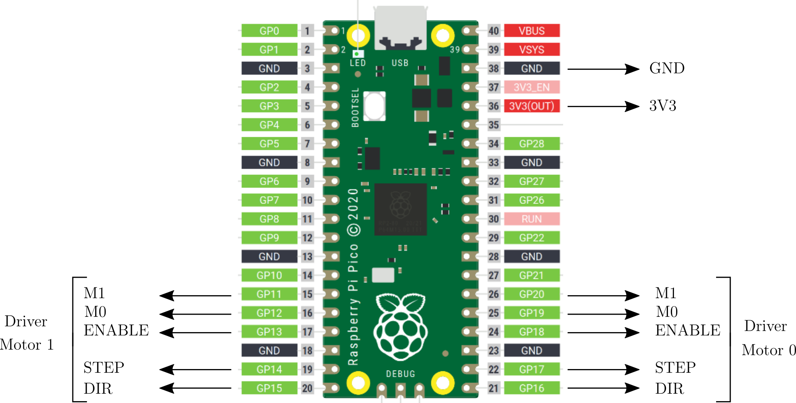

# Introduction

pwmStepper implements a bipolar stepper motor driver for the Raspberry Pi Pico (RASP2). The board must be connected to a hardware driver which can be either DRV8834 or MPU6500 from Pololu.

The driver takes benefit of the RASP2 PIO feature to generate a pwm with acurate period to drive the step pin. The pulse width is set to 3 microseconds.

The step resolution and motor speed can be set and changed 'on the flight'.

Two motors can be driven simultaneoulsy.

# The wiring

# The driver

Copy pwmStepper.py in the RASP2 filesystem, then:

    >>> from pwmStepper import pwmStep
    >>> m0 = pwmStep(0)      # instantiate motor 0 with default config
    >>> m1 = pwmStep(1)      # instantiate motor 1 with default config
    >>> m0.doSteps(100)      # move motor 0 100 steps forward
    >>> m2.doSteps(-50)      # move motor 1 50 steps backward

## Configuration parameters

They must be set at object creation time:

    >>> m0 = pwmStep(..., param=param_value, ...)

with *param* being:

- __dev__ (string) : the hardware motor driver. At present, only two devices are implemented: 'DRV8834' and 'MPU6500'. Default is 'DRV8834'.
- __step_size__ (float) : the stepper full step size, in user units (eg 1.8 for a Nema with 200 steps/rotation)
- __step_unit__ (string) : the step unit (eg 'deg', 'mm', ...)
- __stepRes__ (int) : initial step resolution (1=full step, 2=1/2 step, 4=1/4 step, ...). Default is 1.
- __max_speed__ (float) : the maximum rotation speed, in steep_unit/s
- __min_speed__ (float) : the minimum rotation speed, in steep_unit/s

## Driver functions

They can be called for each driver instantiation:

    >>> m0.func(args)

- step resolution:
  - __setRes__(*res*) : set step resolution to *res* (int). Resolution must be supported by the hardware device (see Pololu docs). Changing step resolution does not change motor speed. 
  - __getRes__() : return resolution (1=full step, 2=1/2 step, ...)
- speed:
  - __setSpeed__(*speed*) : set speed to *speed* in step_unit/s
  - __getSpeed__() : return current speed in step_units/s
- direction
  - __setDir__(*dir*) : set direction to forward if *dir*=1 (int), backward otherwise
  - __getDir__() : return current direction: 1=forward, -1=backward
- steps
  - __doSteps__(*nsteps*) : move *abs(nsteps)* (int) forward if *nsteps>0*, backward otherwise
  - __stop__() : stop the motor (abort current run)
- position
  - __resetPosition__() : set current position to zero (in step_unit)
  - __getPosition__() : return motor position in step_unit since last position reset
 
## Driver constants

- __STEP_MAX_TIMESTEP_MAX_TIME__ : maximum step duration in microseconds. Default is 0xffffffff
- __STEP_MAX_NB__ : maximum number of steps per run (__doSteps__). Default is 0xffffffff
- __PWM_PULSE_WIDTH__ : step pwm pulse width in 0.1 microsecond unit. Default is 30 -> pulse width = 3 microseconds

