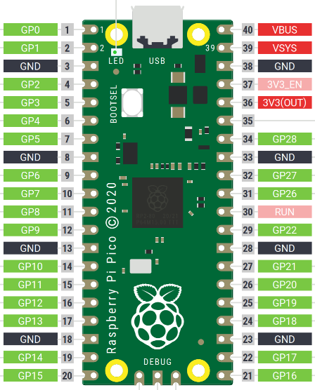

# Introduction

pwmStepper implements a bipolar stepper motor driver for the Raspberry Pi Pico (RASP2). The board must be connected to a hardware driver which can be either DRV8834 or MPU6500 from Pololu.

The driver takes benefit of the RASP2 PIO feature to generate a pwm with acurate period to drive the step pin. The pulse width is set to 3 microseconds.

The step resolution and motor speed can be set and changed 'on the flight'.

Two motors can be driven simultaneoulsy.

# The wiring

